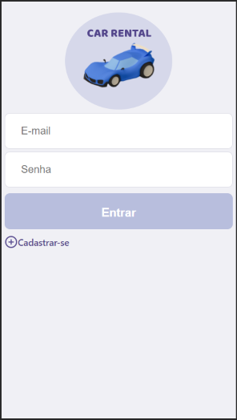

  

# Project

<strong>Car Rental - Web App</strong>

This project aims to present a Web Application that will allow the consultation and maintenance of vehicles from a Car Rental.

 

# Stack

- [Node.js](https://nodejs.org/en)
- [React](https://reactjs.org)

 

# Backend

Developed with: <strong>Node.js</strong>
 
 

To Install: <strong>npm install</strong>
 
To Execute: <strong>npm start</strong>
 

Test URL Examples (Heroku):
 
<strong>Login</strong> https://carrental-backend.herokuapp.com/login
 
<strong>GET user</strong> https://carrental-backend.herokuapp.com/user
 
 
<strong>POST user</strong> https://carrental-backend.herokuapp.com/user
 
JSON Example --> {"email": "nome@email.com","pwd": "abc123"}
 
 
<strong>GET vehicle</strong> https://carrental-backend.herokuapp.com/vehicle
 
<strong>GET vehicle (Query Parameters: page)</strong> https://carrental-backend.herokuapp.com/vehicle?page=1
 
<strong>GET vehicle (Query Parameters: page & plate)</strong> https://carrental-backend.herokuapp.com/vehicle?page=1&plate=FGB1122
 
 
<strong>POST vehicle</strong> https://carrental-backend.herokuapp.com/vehicle
 
<strong>JSON Example --> </strong> Content: {"plate": "JJJ335"}; (Header: Authorization - Value: (ID user))
 
 
<strong>DELETE vehicle</strong> https://carrental-backend.herokuapp.com/vehicle/1
 
(Header: Authorization - Value: (ID user))

 
<strong>-- See JSON Files --</strong>

 

# Frontend

Developed with: <strong>React</strong>
 
 

To Install: <strong>npm install</strong>
 
To Execute: <strong>npm start</strong>
 
 

- External link Web App: [https://carrental-frontend.herokuapp.com](https://carrental-frontend.herokuapp.com)
 

Snapshots:

  
  

 

<!--# Videos-->
<!--
- [Backend: Car Rental - Web App (Parte 1)](https://youtu.be/K7iKAAvOhL4)
- [Backend: Car Rental - Web App (Parte 2)](https://youtu.be/iY7X5dLG4xE)

 
-->
# JSON Files

- [Insomnia JSON - Localhost](https://drive.google.com/file/d/1MHO8500fa_MlngOeHrVf5zUF0PcQaAiP/view?usp=sharing)
- [Insomnia JSON - Heroku](https://drive.google.com/file/d/1yoOkKN3JK6y_iXNeLpcO3LwlhADVwgq9/view?usp=sharing)
